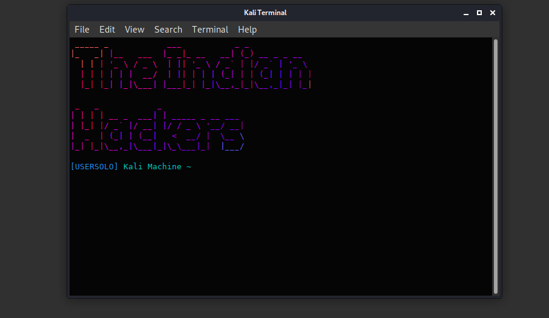

# Beautikali
Make your kali linux terminal good looking

<p align="center">

</p>

## Install

### Installing Dependencies:
```
sudo apt update
sudo apt upgrade
sudo apt-get install figlet lolcat
```
## Installing The new UI
```
cd home/username/
sudo nano .bashrc
```
**After Nano Opens The File Then Copy And Paste everything below to the last line in the .bashrc file**
```
figlet YOUR NAME | lolcat
sleep 2s
PS1="\033[34m[Your Name]\033[36m Kali Machine ~ \033[92m"
```

#### If you faced any issues just write to us at theindianhackers.help@gmail.com
#### Note We Do Not Ask for any OTP or password
#### Talk With Us At Our [Instagram](https://www.instagram.com/theindianhackers)

# Thanks For Reading
# Greating From The Indian Hackers
